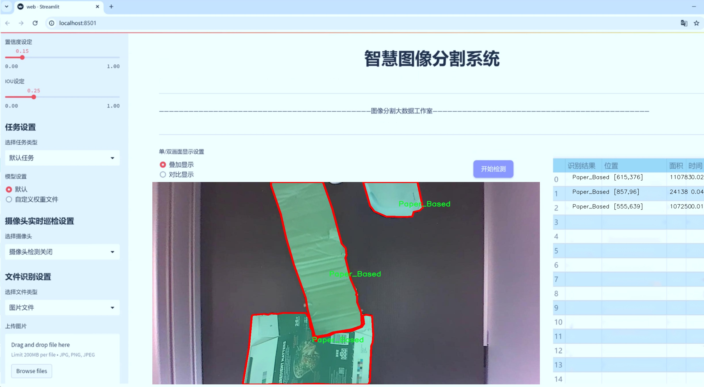
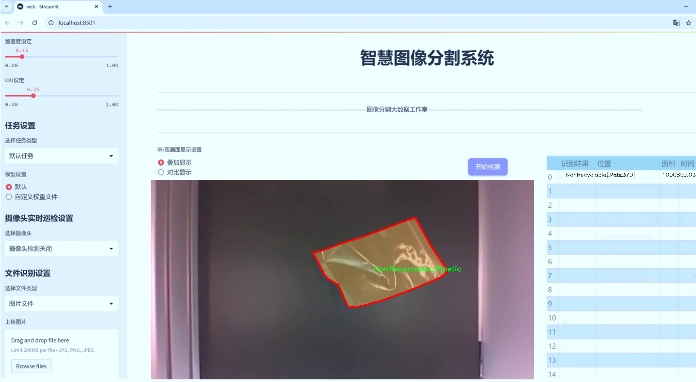
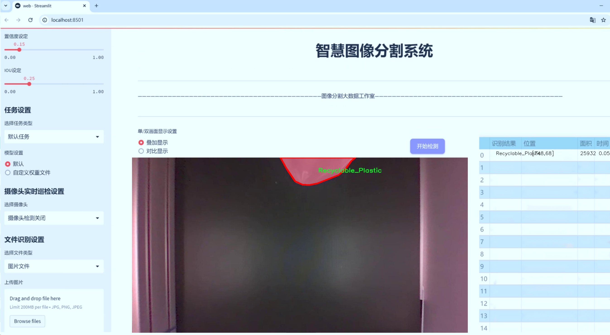
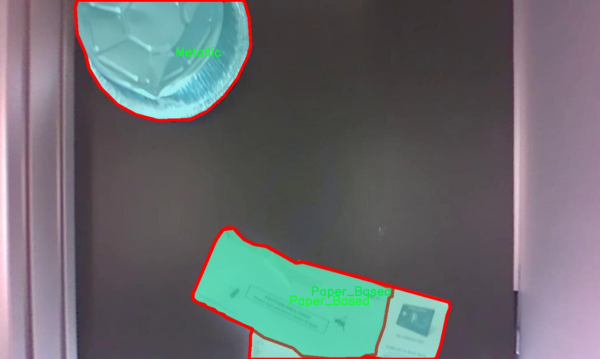
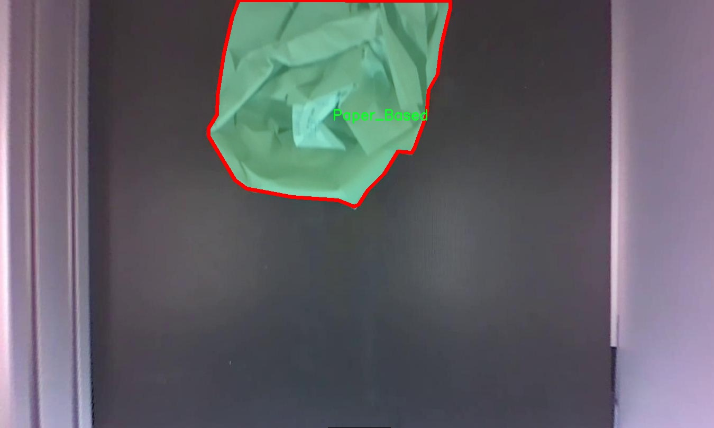
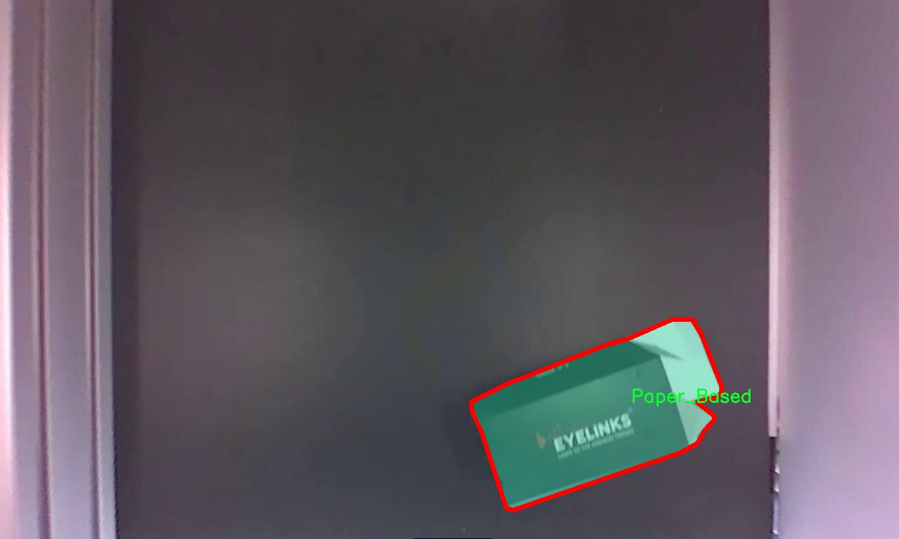
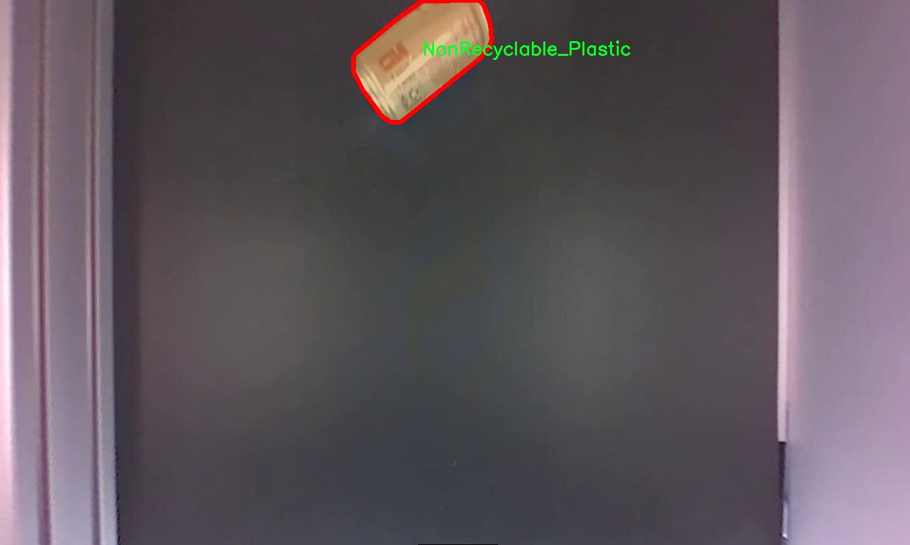
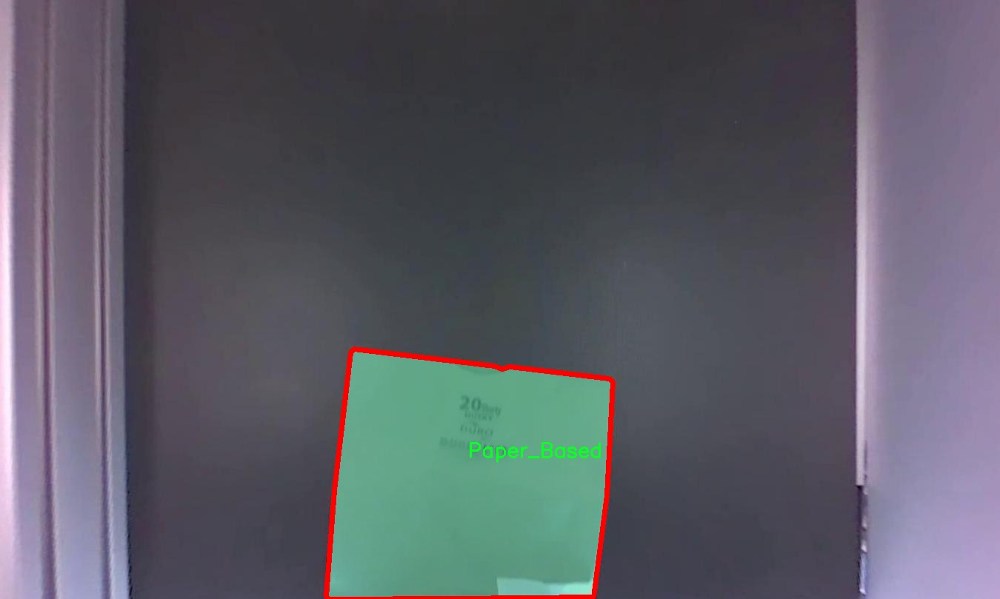

# 可回收材料图像分割系统： yolov8-seg-fasternet

### 1.研究背景与意义

[参考博客](https://gitee.com/YOLOv8_YOLOv11_Segmentation_Studio/projects)

[博客来源](https://kdocs.cn/l/cszuIiCKVNis)

研究背景与意义

随着全球环境问题的日益严重，资源的可持续利用和废物管理已成为当今社会亟待解决的重要课题。尤其是在城市化进程加快的背景下，生活垃圾的产生量不断增加，其中可回收材料的分拣与回收显得尤为重要。有效的垃圾分类不仅能够减少资源浪费，还能降低环境污染，促进循环经济的发展。因此，构建一个高效的可回收材料识别与分割系统，能够为垃圾分类提供技术支持，进而推动可持续发展目标的实现。

在这一背景下，计算机视觉技术的迅猛发展为垃圾分类和可回收材料的自动识别提供了新的解决方案。尤其是深度学习技术的应用，使得图像处理的精度和效率大幅提升。YOLO（You Only Look Once）系列模型作为目标检测领域的佼佼者，其实时性和准确性使其在实际应用中备受青睐。YOLOv8作为该系列的最新版本，进一步优化了模型的结构和算法，具备更强的特征提取能力和更快的推理速度，能够在复杂的环境中实现高效的目标检测和分割。

本研究旨在基于改进的YOLOv8模型，构建一个针对可回收材料的图像分割系统。我们使用的数据集“rdata-office_inst”包含3100张图像，涵盖17个类别的可回收材料，包括铝、纸板、塑料等多种常见材料。这些类别的多样性为模型的训练提供了丰富的样本，有助于提高模型的泛化能力和分类精度。通过对这些图像进行实例分割，我们不仅能够识别出可回收材料的种类，还能精确定位其在图像中的位置，为后续的自动化分拣提供基础。

本研究的意义在于，首先，通过改进YOLOv8模型，我们能够提升可回收材料的识别精度和分割效果，进而为垃圾分类的自动化提供强有力的技术支持。其次，利用大规模的数据集进行训练和验证，可以有效提高模型的鲁棒性，使其在不同环境和条件下均能保持良好的性能。此外，研究成果将为相关领域的研究者提供有价值的参考，推动计算机视觉技术在环境保护和资源管理中的应用。

最后，随着智能化技术的不断进步，基于深度学习的可回收材料图像分割系统将为城市垃圾管理提供新的思路和方法。通过提高可回收材料的识别效率，能够有效促进资源的回收利用，减少环境污染，为实现可持续发展目标贡献力量。因此，本研究不仅具有重要的学术价值，也具备广泛的社会意义，期待能够为未来的垃圾分类和资源管理提供切实可行的解决方案。

### 2.图片演示







注意：本项目提供完整的训练源码数据集和训练教程,由于此博客编辑较早,暂不提供权重文件（best.pt）,需要按照6.训练教程进行训练后实现上图效果。

### 3.视频演示

[3.1 视频演示](https://www.bilibili.com/video/BV1cv6NYdEp8/)

### 4.数据集信息

##### 4.1 数据集类别数＆类别名

nc: 5
names: ['Metallic', 'NonRecyclable_Plastic', 'Organic', 'Paper_Based', 'Recyclable_Plastic']


##### 4.2 数据集信息简介

数据集信息展示

在当今环保意识日益增强的背景下，回收材料的有效分类与处理显得尤为重要。为此，本研究选用了名为“rdata-office_inst”的数据集，以训练和改进YOLOv8-seg的可回收材料图像分割系统。该数据集专注于对五种不同类别的可回收材料进行精准的图像分割，旨在提升机器学习模型在实际应用中的分类准确性和效率。

“rdata-office_inst”数据集包含五个主要类别，分别为：金属（Metallic）、不可回收塑料（NonRecyclable_Plastic）、有机物（Organic）、纸基材料（Paper_Based）和可回收塑料（Recyclable_Plastic）。这些类别的选择不仅反映了现代办公环境中常见的废弃物类型，也为研究提供了丰富的样本和多样化的特征。每个类别的图像样本均经过精心挑选，确保在视觉特征上具有代表性，从而为模型的训练提供高质量的数据基础。

在数据集的构建过程中，研究团队对每一类材料进行了详细的标注，确保每个图像中的目标物体都能被准确识别和分割。这种精确的标注不仅提高了模型的训练效率，也为后续的评估和测试提供了可靠的基准。数据集中的图像涵盖了不同的拍摄角度、光照条件和背景环境，使得模型在面对真实世界的复杂场景时，能够具备更强的适应能力和鲁棒性。

在训练过程中，YOLOv8-seg模型将利用这些多样化的图像数据，通过深度学习算法不断优化其分割性能。模型将学习到每种材料的独特特征，如金属的光泽感、塑料的透明度、有机物的质地等。这些特征不仅有助于提高分类的准确性，也为实现高效的图像分割提供了必要的支持。

此外，数据集的设计还考虑到了可扩展性和适应性。随着回收技术的不断进步和新材料的出现，未来可以通过增添新的类别和样本，进一步丰富数据集的内容。这种灵活性将使得模型在不断变化的环境中，始终保持较高的分类性能。

综上所述，“rdata-office_inst”数据集为训练和改进YOLOv8-seg的可回收材料图像分割系统提供了坚实的基础。通过对五种主要类别的深入研究与分析，该数据集不仅助力于提升机器学习模型的性能，也为推动可回收材料的智能分类与处理提供了新的思路和方法。未来，随着技术的不断进步和数据集的持续完善，期望能够在实际应用中实现更高效的资源回收与环境保护。











### 5.项目依赖环境部署教程（零基础手把手教学）

[5.1 环境部署教程链接（零基础手把手教学）](https://www.bilibili.com/video/BV1jG4Ve4E9t/?vd_source=bc9aec86d164b67a7004b996143742dc)


[5.2 安装Python虚拟环境创建和依赖库安装视频教程链接（零基础手把手教学）](https://www.bilibili.com/video/BV1nA4VeYEze/?vd_source=bc9aec86d164b67a7004b996143742dc)

### 6.手把手YOLOV8-seg训练视频教程（零基础手把手教学）

[6.1 手把手YOLOV8-seg训练视频教程（零基础小白有手就能学会）](https://www.bilibili.com/video/BV1cA4VeYETe/?vd_source=bc9aec86d164b67a7004b996143742dc)


按照上面的训练视频教程链接加载项目提供的数据集，运行train.py即可开始训练



     Epoch   gpu_mem       box       obj       cls    labels  img_size
     1/200     0G   0.01576   0.01955  0.007536        22      1280: 100%|██████████| 849/849 [14:42<00:00,  1.04s/it]
               Class     Images     Labels          P          R     mAP@.5 mAP@.5:.95: 100%|██████████| 213/213 [01:14<00:00,  2.87it/s]
                 all       3395      17314      0.994      0.957      0.0957      0.0843

     Epoch   gpu_mem       box       obj       cls    labels  img_size
     2/200     0G   0.01578   0.01923  0.007006        22      1280: 100%|██████████| 849/849 [14:44<00:00,  1.04s/it]
               Class     Images     Labels          P          R     mAP@.5 mAP@.5:.95: 100%|██████████| 213/213 [01:12<00:00,  2.95it/s]
                 all       3395      17314      0.996      0.956      0.0957      0.0845

     Epoch   gpu_mem       box       obj       cls    labels  img_size
     3/200     0G   0.01561    0.0191  0.006895        27      1280: 100%|██████████| 849/849 [10:56<00:00,  1.29it/s]
               Class     Images     Labels          P          R     mAP@.5 mAP@.5:.95: 100%|███████   | 187/213 [00:52<00:00,  4.04it/s]
                 all       3395      17314      0.996      0.957      0.0957      0.0845


### 7.50+种全套YOLOV8-seg创新点加载调参实验视频教程（一键加载写好的改进模型的配置文件）

[7.1 50+种全套YOLOV8-seg创新点加载调参实验视频教程（一键加载写好的改进模型的配置文件）](https://www.bilibili.com/video/BV1Hw4VePEXv/?vd_source=bc9aec86d164b67a7004b996143742dc)

### YOLOV8-seg算法简介

原始YOLOv8-seg算法原理

YOLOv8-seg算法是YOLO系列目标检测模型的最新版本，结合了目标检测和实例分割的能力，旨在提高在复杂场景下的物体识别和分割精度。该算法在YOLOv8的基础上进行了多项改进，特别是在特征提取、目标检测和分割策略上，展现出更高的灵活性和准确性。

YOLOv8-seg的核心结构依然由Backbone、Neck和Head三部分组成，然而在每个部分的设计上都融入了更为先进的技术。首先，在Backbone部分，YOLOv8-seg采用了CSPDarknet作为特征提取网络，这一结构通过引入交叉阶段部分（Cross Stage Partial，CSP）来优化梯度流动，提升特征提取的效率。CSPDarknet将输入特征图分为多个分支，每个分支经过一系列的卷积层进行处理，最终将特征图融合。这种设计不仅提高了模型的表达能力，还有效减少了计算量。

在特征提取的过程中，YOLOv8-seg引入了C2f模块替代了YOLOv5中的C3模块。C2f模块通过将特征图分成两个分支，并在每个分支中进行降维处理，进一步增强了特征的多样性和丰富性。这种结构的设计使得网络在训练过程中能够更好地捕捉到细粒度的特征信息，从而提升了后续目标检测和分割的性能。

接下来，在Neck部分，YOLOv8-seg继续采用了特征金字塔网络（FPN）和路径聚合网络（PAN）的组合结构。这一结构通过多层次的特征融合，使得不同尺度的特征能够得到充分的利用，从而提升了模型在多尺度目标检测中的表现。FPN负责将高层语义特征与低层细节特征进行融合，而PAN则通过路径聚合的方式进一步增强特征的表达能力。这种多层次的特征处理策略，使得YOLOv8-seg在面对复杂背景和不同尺寸目标时，能够更好地进行分割和识别。

在Head部分，YOLOv8-seg采用了解耦头（Decoupled Head）结构，分别处理目标的分类和定位任务。这一结构的设计使得模型在进行目标检测时，能够更加专注于每个任务的特征提取，提升了整体的检测精度。同时，YOLOv8-seg在分割任务中引入了全卷积网络（Fully Convolutional Network，FCN）的思想，通过对特征图进行上采样，生成与输入图像相同尺寸的分割图，从而实现精确的实例分割。

在数据预处理方面，YOLOv8-seg继承了YOLOv5的多种增强策略，包括马赛克增强、混合增强、空间扰动和颜色扰动等。这些增强手段不仅提高了模型的鲁棒性，还有效地扩展了训练数据的多样性，使得模型在不同场景下的表现更加出色。

值得一提的是，YOLOv8-seg在标签分配策略上进行了创新，采用了动态标签分配策略，旨在提高正负样本的匹配效率。与YOLOv6相似，YOLOv8-seg通过目标框和目标分数的动态分配，优化了训练过程中的样本选择，使得模型能够更好地学习到目标的特征。这一策略的引入，进一步提升了模型在复杂场景下的检测和分割能力。

在损失函数的设计上，YOLOv8-seg引入了变焦损失（Varifocal Loss）和CIoU损失，前者通过对正负样本进行加权，提升了高质量样本对模型训练的贡献，而后者则在位置回归中引入了更为精确的度量标准。这种损失函数的设计，使得模型在训练过程中能够更好地聚焦于高质量的样本，提升了整体的检测精度。

综上所述，YOLOv8-seg算法通过在特征提取、目标检测和分割策略上的多项创新，展现出在复杂场景下的强大能力。其高效的特征提取网络、灵活的标签分配策略以及精确的损失函数设计，使得YOLOv8-seg在目标检测和实例分割任务中均能取得优异的表现，标志着YOLO系列模型在计算机视觉领域的又一次重要进步。


### 9.系统功能展示（检测对象为举例，实际内容以本项目数据集为准）

图9.1.系统支持检测结果表格显示

  图9.2.系统支持置信度和IOU阈值手动调节

  图9.3.系统支持自定义加载权重文件best.pt(需要你通过步骤5中训练获得)

  图9.4.系统支持摄像头实时识别

  图9.5.系统支持图片识别

  图9.6.系统支持视频识别

  图9.7.系统支持识别结果文件自动保存

  图9.8.系统支持Excel导出检测结果数据


### 10.50+种全套YOLOV8-seg创新点原理讲解（非科班也可以轻松写刊发刊，V11版本正在科研待更新）

#### 10.1 由于篇幅限制，每个创新点的具体原理讲解就不一一展开，具体见下列网址中的创新点对应子项目的技术原理博客网址【Blog】：


[10.1 50+种全套YOLOV8-seg创新点原理讲解链接](https://gitee.com/qunmasj/good)

#### 10.2 部分改进模块原理讲解(完整的改进原理见上图和技术博客链接)【如果此小节的图加载失败可以通过CSDN或者Github搜索该博客的标题访问原始博客，原始博客图片显示正常】
### YOLOv8简介
根据官方描述，Yolov8是一个SOTA模型，它建立在Yolo系列历史版本的基础上，并引入了新的功能和改进点，以进一步提升性能和灵活性，使其成为实现目标检测、图像分割、姿态估计等任务的最佳选择。其具体创新点包括一个新的骨干网络、一个新的Ancher-Free检测头和一个新的损失函数，可在CPU到GPU的多种硬件平台上运行。
此外，Yolov8还有一个特点就是可扩展性，ultralytics没有直接将开源库命名为Yolov8，而是直接使用"ultralytcs"，将其定位为算法框架，而非某一个特定算法。这也使得Yolov8开源库不仅仅能够用于Yolo系列模型，而且能够支持非Yolo模型以及分类分割姿态估计等各类任务。
总而言之，Yolov8是Yolo系列模型的最新王者，各种指标全面超越现有对象检测与实例分割模型，借鉴了Yolov5、Yolov6、YoloX等模型的设计优点，在全面提升改进Yolov5模型结构的基础上实现，同时保持了Yolov5工程化简洁易用的优势。

#### Yolov8创新点
Yolov8主要借鉴了Yolov5、Yolov6、YoloX等模型的设计优点，其本身创新点不多，偏重在工程实践上，具体创新如下:
·提供了一个全新的SOTA模型（包括P5 640和P6 1280分辨率的目标检测网络和基于YOLACT的实例分割模型)。并且，基于缩放系数提供了N/S/M/L/X不同尺度的模型，以满足不同部署平台和应用场景的需求。
. Backbone:同样借鉴了CSP模块思想，不过将Yolov5中的C3模块替换成了C2f模块
实现了进—步轻量化，同时沿用Yolov5中的
SPPF模块，并对不同尺度的模型进行精心微调，不再是无脑式一套参数用于所有模型，大幅提升了模型性能。
。Neck:继续使用PAN的思想，但是通过对比YOLOv5与YOLOv8的结构图可以看到，YOLOv8移除了1*1降采样层。
·Head部分相比YOLOv5改动较大，Yolov8换成了目前主流的解耦头结构(Decoupled-Head)，将分类和检测头分离，同时也从Anchor-Based换成了Anchor-Free。
·Loss计算:使用VFLLoss作为分类损失(实际训练中使用BCE Loss);使用DFLLoss+CIOU Loss作为回归损失。
。标签分配: Yolov8抛弃了以往的loU分配或者单边比例的分配方式，而是采用Task-Aligned Assigner正负样本分配策略。
#### Yolov8网络结构
Yolov8模型网络结构图如下图所示。


### Diverse Branch Block简介
参考该博客提出的一种通用的卷积网络构造块用来在不增加任何推理时间的前提下提升卷积网络的性能。我们将这个块命名为分离分支块（Diverse Branch Block）。通过结合不同尺寸和复杂度的分离分支（包括串联卷积、多尺度卷积和平均池化层）来增加特征空间的方法，它提升了单个卷积的表达能力。完成训练后，一个DBB(Diverse Branch Block)可以被等价地转换为一个单独的卷积操作以方便部署。不同于那些新颖的卷积结构的改进方式，DBB让训练时微结构复杂化同时维持大规模结构，因此我们可以将它作为任意结构中通用卷积层的一种嵌入式替代形式。通过这种方式，我们能够将模型训练到一个更高的表现水平，然后在推理时转换成原始推理时间的结构。

 
主要贡献点：

（1） 我们建议合并大量的微结构到不同的卷积结构中来提升性能，但是维持原始的宏观结构。

（2）我们提出DBB，一个通用构造块结构，概括六种转换来将一个DBB结构转化成一个单独卷积，因为对于用户来说它是无损的。

（3）我们提出一个Inception-like DBB结构实例(Fig 1)，并且展示它在ImageNet、COCO detection 和CityScapes任务中获得性能提升。


#### 结构重参数化
本文和一个并发网络RepVGG[1]是第一个使用结构重参数化来命名该思路------使用从其他结构转化来的参数确定当前结构的参数。一个之前的工作ACNet[2]也可以被划分为结构重参数化，它提出使用非对称卷积块来增强卷积核的结构（i.e 十字形结构）。相比于DBB，它被设计来提升卷积网络（在没有额外推理时间损失的条件下）。这个流水线也包含将一个训练好的模型转化为另一个。但是，ACNet和DBB的区别是：ACNet的思想被激发是基于一个观察，这个观察是网络结构的参数在过去有更大的量级，因此寻找方法让参数量级更大，然而我们关注一个不同的点。我们发现 平均池化、1x1 conv 和 1x1-kxk串联卷积是更有效的，因为它们提供了不同复杂度的路线，以及允许使用更多训练时非线性化。除此以外，ACB结构可以看作是DBB结构的一种特殊形式，因为那个1xk和kx1卷积层能够被扩大成kxk（via Transform VI(Fig.2)），然后合并成一个平方核（via Transform II）。

 

#### 分离分支结构
卷积的线性性
一个卷积操作可以表示为 ，其中为输入tensor, 为输出tensor。卷积核表示为一个四阶tensor , 偏置为。将加偏置的操作表示为。

因为，在第j个输出通道（h,w）位置的值可以由以下公式给出：，其中表示输入帧I的第c个通道上的一个滑动窗，对应输出帧O的坐标（h,w）。从上式可以看出，卷积操作具有齐次性和加法性。


注意：加法性成立的条件是两个卷积具有相同的配置（即通道数、核尺寸、步长和padding等）。

#### 分离分支的卷积
在这一小节，我们概括六种转换形式（Fig.2）来转换一个具有batch normalization(BN)、branch addition、depth concatenation、multi-scale operations、avarage pooling 和 sequences of convolutions的DBB分支。


Transform I：a conv for conv-BN  我们通常会给一个卷积配备配备一个BN层，它执行逐通道正则化和线性尺度放缩。设j为通道索引，分别为累积的逐通道均值和标准差，分别为学习的尺度因子和偏置项，对应输出通道j为


卷积的齐次性允许我们融合BN操作到前述的conv来做推理。在实践中，我们仅仅建立一个拥有卷积核和偏置, 用从原始BN序列的参数转换来的值来赋值。我们为每个输出通道j构造


Transform II a conv for branch addition  卷积的加法性确保如果有两个或者多个具有相同配置的卷积层相加，我们能够将它们合并到一个单独的卷积里面。对于conv-BN，我们应该首先执行Transform I。很明显的，通过下面的公式我们能够合并两个卷积


上述公式只有在两个卷积拥有相同配置时才成立。尽管合并上述分支能够在一定程度上增强模型，我们希望结合不同分支来进一步提升模型性能。在后面，我们介绍一些分支的形式，它们能够等价地被转化为一个单独的卷积。在通过多个转化来为每一个分支构造KxK的卷积之后，我们使用Transform II 将所有分支合并到一个conv里面。

Transform III: a conv for sequential convolutions   我们能够合并一个1x1 conv-BN-kxk conv序列到一个kxk conv里面。我们暂时假设卷积是稠密的（即 组数 groups=1）。组数groups>1的情形将会在Transform IV中实现。我们假定1x1和kxk卷积层的核形状分别是DxCx1x1和ExDxKxK，这里D指任意值。首先，我们将两个BN层融合到两个卷积层里面，由此获得。输出是


我们期望用一个单独卷积的核和偏置来表达，设, 它们满足。对方程（8）应用卷积的加法性，我们有


因为是一个1x1 conv，它只执行逐通道线性组合，没有空间聚合操作。通过线性重组KxK卷积核中的参数，我们能够将它合并到一个KxK的卷积核里面。容易证明的是，这样的转换可以由一个转置卷积实现：


其中是由转置获得的tensor张量。方程（10）的第二项是作用于常量矩阵上的卷积操作，因此它的输出也是一个常量矩阵。用表达式来说明，设是一个常数矩阵，其中的每个元素都等于p。*是一个2D 卷积操作，W为一个2D 卷积核。转换结果就是一个常量矩阵，这个常量矩阵是p 与 所有核元素之和 的乘积，即


基于以上观察，我们构造。然后，容易证明。

因此我们有

显而易见地，对于一个zero-pads 的KxK卷积，方程（8）并不成立，因为并不对的结果做卷积操作(如果有一个零元素的额外的圈，方程（8）成立)。解决方案有A)用padding配置第一个卷积，第二个卷积不用，B)通过做pad操作。后者的一个有效实现是定制第一个BN层，为了（1）如通常的batch-normalize输入。（2）计算(通过方程（6）)。（3）用  pad batch-normalized结果，例如 用一圈 pad 每一个通道j 。

Transform IV: a conv for depth concatenation  Inception 单元使用深度concatenation来组合不同分支。当每个分支都只包含一个相同配置的卷积时，深度concatenation等价于一个卷积，它的核在不同的输出通道上concatenation（比如我们公式中的第一个轴）假设。我们concatenate它们到。显然地


Transform IV 可以非常方便地将Transform III 扩展到 groupwise（即 groups > 1） 的情景。直觉上，一个groupwise 卷积将输入分割成g个并行的组，单独卷积它们，然后concatenate形成输出。为了代替g-group卷积，我们建立一个DBB结构，这个结构的所有卷积层有相同的组g。为了转换一个1x1-KxK序列，我们等价地分割它们成为g组，单独执行Transform III, 然后concatenate获得输出（如图Fig3所示）。


Transform V: a conv for average pooling  一个作用于C通道的核尺寸为K，步长为s的平均池化层等价于一个拥有相同核尺寸K,步长s的卷积层。这样的核可以被构造为

  


就像一个通常的平均池化操作，当s>1时执行降采样操作，当s=1时保持相同尺寸。

Transform VI: a conv for multi-scale convolutions   考虑一个等价于一个拥有相同zero padding的 核。特别地，卷积是格外实用的，因为它们能够有效实现。应该对输入作pad操作来对齐滑动窗。


### 11.项目核心源码讲解（再也不用担心看不懂代码逻辑）

#### 11.1 ultralytics\utils\errors.py

以下是代码的核心部分，并附上详细的中文注释：

```python
# Ultralytics YOLO 🚀, AGPL-3.0 license

from ultralytics.utils import emojis  # 导入用于处理表情符号的工具

class HUBModelError(Exception):
    """
    自定义异常类，用于处理与Ultralytics YOLO模型获取相关的错误。

    当请求的模型未找到或无法检索时，将引发此异常。
    消息经过处理，以包含表情符号，从而改善用户体验。

    属性:
        message (str): 引发异常时显示的错误消息。

    注意:
        消息会通过'ultralytics.utils'包中的'emojis'函数自动处理。
    """

    def __init__(self, message='Model not found. Please check model URL and try again.'):
        """当模型未找到时创建异常。"""
        super().__init__(emojis(message))  # 调用父类构造函数，并处理消息中的表情符号
```

### 代码分析：
1. **导入模块**：从`ultralytics.utils`导入`emojis`函数，用于处理消息中的表情符号。
2. **自定义异常类**：`HUBModelError`继承自Python内置的`Exception`类，用于创建特定于模型获取错误的异常。
3. **构造函数**：
   - 默认消息为“模型未找到，请检查模型URL并重试”。
   - 使用`super().__init__(...)`调用父类的构造函数，并将处理过的消息传递给它，以便在异常被引发时显示。

### 总结：
该代码定义了一个自定义异常类，用于在Ultralytics YOLO模型未找到时提供友好的错误提示，并且通过表情符号增强用户体验。

这个文件是Ultralytics YOLO项目中的一个错误处理模块，主要定义了一个自定义异常类`HUBModelError`。该类用于处理与模型获取相关的错误，特别是在请求的模型未找到或无法检索时引发此异常。

在这个类中，构造函数`__init__`接受一个可选的字符串参数`message`，默认值为“Model not found. Please check model URL and try again.”，即“未找到模型。请检查模型URL并重试。”。当实例化这个异常时，构造函数会调用父类`Exception`的构造函数，并通过`emojis`函数处理消息，这样可以在错误消息中添加表情符号，以提升用户体验。

该类的文档字符串详细说明了其用途和属性，强调了该异常的主要功能是提供更友好的错误提示，帮助用户更好地理解问题所在。通过这种方式，开发者可以在代码中捕获并处理与模型相关的错误，确保程序的健壮性和用户的良好体验。

#### 11.2 ultralytics\utils\callbacks\mlflow.py

以下是经过简化和注释的核心代码部分：

```python
# 导入必要的库和模块
from ultralytics.utils import LOGGER, RUNS_DIR, SETTINGS, TESTS_RUNNING, colorstr

try:
    import os
    import mlflow  # 导入MLflow库用于日志记录

    # 确保在非测试环境下运行，并且MLflow集成已启用
    assert not TESTS_RUNNING or 'test_mlflow' in os.environ.get('PYTEST_CURRENT_TEST', '')
    assert SETTINGS['mlflow'] is True  # 验证集成是否启用

    # 确保mlflow模块是有效的
    assert hasattr(mlflow, '__version__')
    from pathlib import Path
    PREFIX = colorstr('MLflow: ')  # 设置日志前缀

except (ImportError, AssertionError):
    mlflow = None  # 如果导入失败，mlflow设置为None


def on_pretrain_routine_end(trainer):
    """
    在预训练例程结束时记录训练参数到MLflow。

    参数:
        trainer (ultralytics.engine.trainer.BaseTrainer): 包含要记录的参数的训练对象。

    全局变量:
        mlflow: 用于记录的mlflow模块。

    环境变量:
        MLFLOW_TRACKING_URI: MLflow跟踪的URI。如果未设置，默认为'runs/mlflow'。
        MLFLOW_EXPERIMENT_NAME: MLflow实验的名称。如果未设置，默认为trainer.args.project。
        MLFLOW_RUN: MLflow运行的名称。如果未设置，默认为trainer.args.name。
    """
    global mlflow

    # 获取跟踪URI，默认为'runs/mlflow'
    uri = os.environ.get('MLFLOW_TRACKING_URI') or str(RUNS_DIR / 'mlflow')
    LOGGER.debug(f'{PREFIX} tracking uri: {uri}')
    mlflow.set_tracking_uri(uri)  # 设置MLflow跟踪URI

    # 设置实验和运行名称
    experiment_name = os.environ.get('MLFLOW_EXPERIMENT_NAME') or trainer.args.project or '/Shared/YOLOv8'
    run_name = os.environ.get('MLFLOW_RUN') or trainer.args.name
    mlflow.set_experiment(experiment_name)  # 设置实验名称

    mlflow.autolog()  # 启用自动日志记录
    try:
        # 开始一个新的运行或获取当前活动的运行
        active_run = mlflow.active_run() or mlflow.start_run(run_name=run_name)
        LOGGER.info(f'{PREFIX}logging run_id({active_run.info.run_id}) to {uri}')
        if Path(uri).is_dir():
            LOGGER.info(f"{PREFIX}view at http://127.0.0.1:5000 with 'mlflow server --backend-store-uri {uri}'")
        LOGGER.info(f"{PREFIX}disable with 'yolo settings mlflow=False'")
        mlflow.log_params(dict(trainer.args))  # 记录训练参数
    except Exception as e:
        LOGGER.warning(f'{PREFIX}WARNING ⚠️ Failed to initialize: {e}\n'
                       f'{PREFIX}WARNING ⚠️ Not tracking this run')


def on_fit_epoch_end(trainer):
    """在每个训练周期结束时记录训练指标到MLflow。"""
    if mlflow:
        # 清理指标名称并记录
        sanitized_metrics = {k.replace('(', '').replace(')', ''): float(v) for k, v in trainer.metrics.items()}
        mlflow.log_metrics(metrics=sanitized_metrics, step=trainer.epoch)  # 记录指标


def on_train_end(trainer):
    """在训练结束时记录模型工件。"""
    if mlflow:
        # 记录最佳模型和最后模型的文件
        mlflow.log_artifact(str(trainer.best.parent))
        for f in trainer.save_dir.glob('*'):  # 记录保存目录中的所有文件
            if f.suffix in {'.png', '.jpg', '.csv', '.pt', '.yaml'}:
                mlflow.log_artifact(str(f))

        mlflow.end_run()  # 结束当前运行
        LOGGER.info(f'{PREFIX}results logged to {mlflow.get_tracking_uri()}\n'
                    f"{PREFIX}disable with 'yolo settings mlflow=False'")


# 定义回调函数字典
callbacks = {
    'on_pretrain_routine_end': on_pretrain_routine_end,
    'on_fit_epoch_end': on_fit_epoch_end,
    'on_train_end': on_train_end} if mlflow else {}
```

### 代码注释说明：
1. **导入部分**：导入必要的库和模块，包括Ultralytics的工具和MLflow库。
2. **异常处理**：确保在导入MLflow时没有错误，并且在测试环境下不会记录日志。
3. **`on_pretrain_routine_end`函数**：在预训练结束时记录训练参数，设置跟踪URI、实验名称和运行名称，并记录参数。
4. **`on_fit_epoch_end`函数**：在每个训练周期结束时记录训练指标。
5. **`on_train_end`函数**：在训练结束时记录模型的工件（如权重文件和其他相关文件）。
6. **回调字典**：根据是否成功导入MLflow，定义相应的回调函数。

这个程序文件是用于Ultralytics YOLO模型的MLflow日志记录模块。MLflow是一个开源平台，用于管理机器学习实验的生命周期，包括实验的跟踪、模型的注册和部署等。该模块的主要功能是记录训练过程中的参数、指标和模型工件。

文件开头包含了一些注释，介绍了模块的功能和使用方法。用户可以通过设置环境变量来配置实验名称、运行名称和跟踪URI等。文件中提供了相关的命令行指令，帮助用户启动本地的MLflow服务器和管理正在运行的服务器实例。

接下来，文件导入了一些必要的库和模块，包括Ultralytics的日志记录器和一些设置。通过try-except结构，文件尝试导入MLflow模块，并进行了一些基本的检查，以确保MLflow的正确安装和集成。

文件定义了三个主要的回调函数：

1. **on_pretrain_routine_end**：在预训练例程结束时调用。该函数根据环境变量和训练器的参数设置MLflow的跟踪URI、实验名称和运行名称。如果没有活动的运行，则启动一个新的MLflow运行。最后，它会记录训练器的参数。如果在初始化过程中出现任何异常，函数会记录警告信息。

2. **on_fit_epoch_end**：在每个训练周期结束时调用。该函数会将训练指标记录到MLflow中，确保指标的键名经过清理（去掉括号），并将其值转换为浮点数。

3. **on_train_end**：在训练结束时调用。该函数会记录模型的工件，包括最佳模型和其他文件（如图像、CSV、YAML等）。最后，它会结束当前的MLflow运行，并记录结果的URI。

最后，文件定义了一个回调字典，包含了上述三个函数，只有在成功导入MLflow的情况下才会创建这个字典。这个字典可以用于在训练过程中自动调用相应的回调函数，以实现日志记录的功能。

总体而言，这个模块为Ultralytics YOLO提供了一个方便的接口，以便用户能够轻松地记录和管理他们的机器学习实验。

#### 11.3 ultralytics\solutions\ai_gym.py

以下是代码中最核心的部分，并附上详细的中文注释：

```python
import cv2
from ultralytics.utils.plotting import Annotator

class AIGym:
    """用于管理基于姿势的实时视频流中的健身步骤的类。"""

    def __init__(self):
        """初始化 AIGym，设置视觉和图像参数的默认值。"""
        self.im0 = None  # 当前帧图像
        self.tf = None   # 线条厚度
        self.keypoints = None  # 姿势关键点
        self.poseup_angle = None  # 上升姿势的角度阈值
        self.posedown_angle = None  # 下降姿势的角度阈值
        self.threshold = 0.001  # 阈值，用于判断姿势变化
        self.angle = None  # 存储角度信息
        self.count = None  # 存储计数信息
        self.stage = None  # 存储当前阶段信息
        self.pose_type = 'pushup'  # 默认姿势类型
        self.kpts_to_check = None  # 用于计数的关键点
        self.view_img = False  # 是否显示图像
        self.annotator = None  # 注释工具

    def set_args(self, kpts_to_check, line_thickness=2, view_img=False, pose_up_angle=145.0, pose_down_angle=90.0, pose_type='pullup'):
        """
        配置 AIGym 的参数，包括关键点、线条厚度、图像显示等。
        Args:
            kpts_to_check (list): 用于计数的 3 个关键点
            line_thickness (int): 边界框的线条厚度
            view_img (bool): 是否显示图像
            pose_up_angle (float): 上升姿势的角度
            pose_down_angle (float): 下降姿势的角度
            pose_type: "pushup", "pullup" 或 "abworkout"
        """
        self.kpts_to_check = kpts_to_check
        self.tf = line_thickness
        self.view_img = view_img
        self.poseup_angle = pose_up_angle
        self.posedown_angle = pose_down_angle
        self.pose_type = pose_type

    def start_counting(self, im0, results, frame_count):
        """
        计数健身步骤的函数。
        Args:
            im0 (ndarray): 当前视频流的帧图像
            results: 姿势估计数据
            frame_count: 当前帧计数
        """
        self.im0 = im0  # 更新当前帧图像
        if frame_count == 1:
            # 初始化计数和角度信息
            self.count = [0] * len(results[0])
            self.angle = [0] * len(results[0])
            self.stage = ['-' for _ in results[0]]
        
        self.keypoints = results[0].keypoints.data  # 获取关键点数据
        self.annotator = Annotator(im0, line_width=2)  # 初始化注释工具

        for ind, k in enumerate(reversed(self.keypoints)):
            # 计算姿势角度
            self.angle[ind] = self.annotator.estimate_pose_angle(
                k[int(self.kpts_to_check[0])].cpu(),
                k[int(self.kpts_to_check[1])].cpu(),
                k[int(self.kpts_to_check[2])].cpu()
            )
            self.im0 = self.annotator.draw_specific_points(k, self.kpts_to_check, shape=(640, 640), radius=10)

            # 根据姿势类型更新阶段和计数
            if self.pose_type == 'pushup':
                if self.angle[ind] > self.poseup_angle:
                    self.stage[ind] = 'up'
                if self.angle[ind] < self.posedown_angle and self.stage[ind] == 'up':
                    self.stage[ind] = 'down'
                    self.count[ind] += 1

            elif self.pose_type == 'pullup':
                if self.angle[ind] > self.poseup_angle:
                    self.stage[ind] = 'down'
                if self.angle[ind] < self.posedown_angle and self.stage[ind] == 'down':
                    self.stage[ind] = 'up'
                    self.count[ind] += 1

            # 绘制角度、计数和阶段信息
            self.annotator.plot_angle_and_count_and_stage(
                angle_text=self.angle[ind],
                count_text=self.count[ind],
                stage_text=self.stage[ind],
                center_kpt=k[int(self.kpts_to_check[1])],
                line_thickness=self.tf
            )

            self.annotator.kpts(k, shape=(640, 640), radius=1, kpt_line=True)  # 绘制关键点

        # 如果需要显示图像，则展示当前帧
        if self.view_img:
            cv2.imshow('Ultralytics YOLOv8 AI GYM', self.im0)
            if cv2.waitKey(1) & 0xFF == ord('q'):
                return

if __name__ == '__main__':
    AIGym()  # 创建 AIGym 实例
```

### 代码核心部分说明：
1. **类的初始化**：设置了一些基本的参数，包括图像、关键点、计数、角度和阶段等。
2. **设置参数**：`set_args` 方法用于配置关键点、线条厚度、图像显示等参数。
3. **计数功能**：`start_counting` 方法负责根据视频流中的姿势估计数据来计算健身动作的数量，并更新相应的状态信息。
4. **绘制与显示**：使用 `Annotator` 类来绘制关键点、角度、计数和阶段信息，并在需要时显示图像。

这个程序文件定义了一个名为 `AIGym` 的类，旨在管理基于姿势的实时视频流中人们的健身动作计数。该类主要用于识别和计数不同类型的健身动作，如俯卧撑、引体向上和腹部锻炼。

在 `__init__` 方法中，类初始化了一些默认值，包括图像和线条的厚度、关键点信息、角度、计数和阶段信息等。具体来说，它定义了图像、线条厚度、关键点、上下姿势角度、阈值、计数、阶段和动作类型等属性。此外，还有一个用于可视化的标注器 `annotator`。

`set_args` 方法用于配置一些参数，包括需要检查的关键点、线条厚度、是否显示图像、上下姿势的角度以及动作类型。该方法接收这些参数并将其存储在类的属性中。

`start_counting` 方法是该类的核心功能，用于实时计数健身动作。它接收当前帧图像、姿势估计结果和当前帧计数作为输入。在方法内部，首先会初始化计数和角度列表，然后提取关键点数据。接着，根据不同的动作类型（如俯卧撑、引体向上和腹部锻炼），计算每个关键点的姿势角度，并根据设定的角度阈值判断当前的动作阶段（上或下）。在每个阶段，计数器会相应增加，并通过 `annotator` 绘制出关键点、角度、计数和阶段信息。

最后，如果设置了 `view_img` 为 `True`，程序会使用 OpenCV 显示当前处理的图像，并在按下 'q' 键时退出显示。

整个程序通过对实时视频流中人的姿势进行分析，帮助用户跟踪和计数他们的健身动作，从而提高锻炼的效果和效率。

#### 11.4 ultralytics\models\sam\modules\decoders.py

以下是经过简化和注释的核心代码部分，主要保留了 `MaskDecoder` 类及其核心方法，并对每个部分进行了详细的中文注释。

```python
import torch
from torch import nn
from torch.nn import functional as F
from ultralytics.nn.modules import LayerNorm2d

class MaskDecoder(nn.Module):
    """
    MaskDecoder 类用于生成图像的掩码及其质量评分，使用变换器架构根据图像和提示嵌入预测掩码。
    """

    def __init__(self, transformer_dim: int, transformer: nn.Module, num_multimask_outputs: int = 3) -> None:
        """
        初始化 MaskDecoder。

        参数:
            transformer_dim (int): 变换器模块的通道维度。
            transformer (nn.Module): 用于预测掩码的变换器模块。
            num_multimask_outputs (int): 预测的掩码数量，用于消歧义。
        """
        super().__init__()
        self.transformer_dim = transformer_dim  # 变换器的通道维度
        self.transformer = transformer  # 变换器模块

        self.num_multimask_outputs = num_multimask_outputs  # 预测的掩码数量

        # 定义 IoU token 和掩码 token 的嵌入
        self.iou_token = nn.Embedding(1, transformer_dim)  # IoU token 的嵌入
        self.mask_tokens = nn.Embedding(num_multimask_outputs + 1, transformer_dim)  # 掩码 token 的嵌入

        # 定义输出上采样的神经网络序列
        self.output_upscaling = nn.Sequential(
            nn.ConvTranspose2d(transformer_dim, transformer_dim // 4, kernel_size=2, stride=2),
            LayerNorm2d(transformer_dim // 4),
            nn.GELU(),  # 使用 GELU 激活函数
            nn.ConvTranspose2d(transformer_dim // 4, transformer_dim // 8, kernel_size=2, stride=2),
            nn.GELU(),
        )

        # 定义用于生成掩码的超网络 MLP
        self.output_hypernetworks_mlps = nn.ModuleList([
            MLP(transformer_dim, transformer_dim, transformer_dim // 8, 3) for _ in range(num_multimask_outputs + 1)
        ])

        # 定义用于预测掩码质量的 MLP
        self.iou_prediction_head = MLP(transformer_dim, 256, num_multimask_outputs + 1, 3)

    def forward(self, image_embeddings: torch.Tensor, sparse_prompt_embeddings: torch.Tensor, multimask_output: bool) -> Tuple[torch.Tensor, torch.Tensor]:
        """
        根据图像和提示嵌入预测掩码。

        参数:
            image_embeddings (torch.Tensor): 图像编码器的嵌入。
            sparse_prompt_embeddings (torch.Tensor): 稀疏提示的嵌入。
            multimask_output (bool): 是否返回多个掩码。

        返回:
            torch.Tensor: 预测的掩码。
            torch.Tensor: 掩码质量的预测。
        """
        masks, iou_pred = self.predict_masks(image_embeddings, sparse_prompt_embeddings)

        # 根据是否需要多个掩码选择输出
        mask_slice = slice(1, None) if multimask_output else slice(0, 1)
        masks = masks[:, mask_slice, :, :]
        iou_pred = iou_pred[:, mask_slice]

        return masks, iou_pred

    def predict_masks(self, image_embeddings: torch.Tensor, sparse_prompt_embeddings: torch.Tensor) -> Tuple[torch.Tensor, torch.Tensor]:
        """
        预测掩码。

        参数:
            image_embeddings (torch.Tensor): 图像编码器的嵌入。
            sparse_prompt_embeddings (torch.Tensor): 稀疏提示的嵌入。

        返回:
            torch.Tensor: 预测的掩码。
            torch.Tensor: 掩码质量的预测。
        """
        # 连接输出 tokens
        output_tokens = torch.cat([self.iou_token.weight, self.mask_tokens.weight], dim=0)
        output_tokens = output_tokens.unsqueeze(0).expand(sparse_prompt_embeddings.size(0), -1, -1)
        tokens = torch.cat((output_tokens, sparse_prompt_embeddings), dim=1)

        # 扩展每个图像的数据以适应每个掩码
        src = torch.repeat_interleave(image_embeddings, tokens.shape[0], dim=0)
        src = src + sparse_prompt_embeddings  # 添加提示嵌入
        b, c, h, w = src.shape

        # 运行变换器
        hs, src = self.transformer(src, tokens)
        iou_token_out = hs[:, 0, :]  # IoU token 的输出
        mask_tokens_out = hs[:, 1:(1 + self.num_multimask_outputs), :]  # 掩码 tokens 的输出

        # 上采样掩码嵌入并预测掩码
        src = src.transpose(1, 2).view(b, c, h, w)
        upscaled_embedding = self.output_upscaling(src)
        hyper_in_list = [self.output_hypernetworks_mlps[i](mask_tokens_out[:, i, :]) for i in range(self.num_multimask_outputs + 1)]
        hyper_in = torch.stack(hyper_in_list, dim=1)
        masks = (hyper_in @ upscaled_embedding.view(b, c, h * w)).view(b, -1, h, w)

        # 生成掩码质量预测
        iou_pred = self.iou_prediction_head(iou_token_out)

        return masks, iou_pred

class MLP(nn.Module):
    """
    多层感知机（MLP）模型，用于掩码质量预测。
    """

    def __init__(self, input_dim: int, hidden_dim: int, output_dim: int, num_layers: int) -> None:
        """
        初始化 MLP 模型。

        参数:
            input_dim (int): 输入特征的维度。
            hidden_dim (int): 隐藏层的维度。
            output_dim (int): 输出层的维度。
            num_layers (int): 隐藏层的数量。
        """
        super().__init__()
        self.layers = nn.ModuleList(nn.Linear(n, k) for n, k in zip([input_dim] + [hidden_dim] * (num_layers - 1), [hidden_dim] * (num_layers - 1) + [output_dim]))

    def forward(self, x):
        """执行前向传播并应用激活函数。"""
        for i, layer in enumerate(self.layers):
            x = F.relu(layer(x)) if i < len(self.layers) - 1 else layer(x)  # 最后一层不使用激活函数
        return x
```

### 代码说明
1. **MaskDecoder 类**: 该类负责生成图像的掩码及其质量评分。它使用变换器架构来处理图像和提示嵌入，并生成多个掩码。
2. **__init__ 方法**: 初始化模型的各个组件，包括变换器、掩码 token 和 IoU token 的嵌入，以及用于上采样和质量预测的 MLP。
3. **forward 方法**: 接收图像嵌入和提示嵌入，调用 `predict_masks` 方法生成掩码和质量评分，并根据需要选择返回的掩码。
4. **predict_masks 方法**: 连接 IoU token 和掩码 token，运行变换器以生成掩码，并通过 MLP 预测掩码质量。
5. **MLP 类**: 实现了一个简单的多层感知机，用于处理特征并生成输出。

这个程序文件定义了一个名为 `MaskDecoder` 的类，主要用于生成图像的掩码及其质量评分，采用了变换器（Transformer）架构来根据图像和提示嵌入预测掩码。类的构造函数接受多个参数，包括变换器的维度、变换器模块、要预测的掩码数量、激活函数类型等，并初始化了相关的属性。

在 `__init__` 方法中，首先定义了变换器的维度和模块。接着，创建了一个用于表示 IoU（Intersection over Union）标记的嵌入层，以及一个用于掩码标记的嵌入层。随后，构建了一个用于上采样输出的神经网络序列，包含多个转置卷积层和层归一化。还定义了一个超网络 MLP 列表，用于生成掩码，以及一个用于预测掩码质量的 MLP。

`forward` 方法是类的主要接口，用于根据输入的图像嵌入和提示嵌入预测掩码。在该方法中，首先调用 `predict_masks` 方法生成掩码和 IoU 预测。然后，根据是否需要多掩码输出来选择合适的掩码，并准备返回的输出。

`predict_masks` 方法负责具体的掩码预测过程。它首先将 IoU 标记和掩码标记的嵌入连接起来，并与稀疏提示嵌入一起形成输入令牌。接着，将图像嵌入和密集提示嵌入进行扩展，以便于在变换器中处理。通过变换器的前向传播，得到 IoU 标记的输出和掩码标记的输出。然后，利用上采样和超网络 MLP 生成最终的掩码，并通过 IoU 预测头生成掩码质量的预测。

此外，文件中还定义了一个 `MLP` 类，用于构建多层感知机模型。该类的构造函数接受输入维度、隐藏层维度、输出维度和层数等参数，并初始化相应的线性层。在 `forward` 方法中，依次通过每一层进行前向传播，并在最后一层选择性地应用 Sigmoid 激活函数。

整体来看，这个文件实现了一个复杂的掩码解码器，结合了深度学习中的变换器架构和多层感知机，用于图像分割任务中的掩码生成和质量评估。

#### 11.5 ultralytics\models\rtdetr\train.py

以下是代码中最核心的部分，并附上详细的中文注释：

```python
# 导入必要的库
from copy import copy
import torch
from ultralytics.models.yolo.detect import DetectionTrainer
from ultralytics.nn.tasks import RTDETRDetectionModel
from ultralytics.utils import RANK, colorstr
from .val import RTDETRDataset, RTDETRValidator

class RTDETRTrainer(DetectionTrainer):
    """
    RT-DETR模型的训练类，专为百度开发的实时目标检测而设计。
    该类扩展了YOLO的DetectionTrainer类，以适应RT-DETR的特定特性和架构。
    RT-DETR模型利用了视觉变换器（Vision Transformers），并具备IoU感知查询选择和可调的推理速度等能力。
    """

    def get_model(self, cfg=None, weights=None, verbose=True):
        """
        初始化并返回一个用于目标检测任务的RT-DETR模型。

        参数:
            cfg (dict, optional): 模型配置，默认为None。
            weights (str, optional): 预训练模型权重的路径，默认为None。
            verbose (bool): 如果为True，则启用详细日志，默认为True。

        返回:
            (RTDETRDetectionModel): 初始化后的模型。
        """
        # 创建RT-DETR检测模型实例
        model = RTDETRDetectionModel(cfg, nc=self.data['nc'], verbose=verbose and RANK == -1)
        # 如果提供了权重，则加载权重
        if weights:
            model.load(weights)
        return model

    def build_dataset(self, img_path, mode='val', batch=None):
        """
        构建并返回用于训练或验证的RT-DETR数据集。

        参数:
            img_path (str): 包含图像的文件夹路径。
            mode (str): 数据集模式，可以是'train'或'val'。
            batch (int, optional): 矩形训练的批量大小，默认为None。

        返回:
            (RTDETRDataset): 针对特定模式的数据集对象。
        """
        # 创建RT-DETR数据集实例
        return RTDETRDataset(img_path=img_path,
                             imgsz=self.args.imgsz,
                             batch_size=batch,
                             augment=mode == 'train',  # 训练模式下进行数据增强
                             hyp=self.args,
                             rect=False,
                             cache=self.args.cache or None,
                             prefix=colorstr(f'{mode}: '),  # 添加模式前缀
                             data=self.data)

    def get_validator(self):
        """
        返回适合RT-DETR模型验证的DetectionValidator。

        返回:
            (RTDETRValidator): 用于模型验证的验证器对象。
        """
        self.loss_names = 'giou_loss', 'cls_loss', 'l1_loss'  # 定义损失名称
        return RTDETRValidator(self.test_loader, save_dir=self.save_dir, args=copy(self.args))

    def preprocess_batch(self, batch):
        """
        预处理一批图像。对图像进行缩放并转换为浮点格式。

        参数:
            batch (dict): 包含一批图像、边界框和标签的字典。

        返回:
            (dict): 预处理后的批次数据。
        """
        # 调用父类的方法进行预处理
        batch = super().preprocess_batch(batch)
        bs = len(batch['img'])  # 批次大小
        batch_idx = batch['batch_idx']  # 批次索引
        gt_bbox, gt_class = [], []  # 初始化真实边界框和类别列表
        for i in range(bs):
            # 收集每个图像的真实边界框和类别
            gt_bbox.append(batch['bboxes'][batch_idx == i].to(batch_idx.device))
            gt_class.append(batch['cls'][batch_idx == i].to(device=batch_idx.device, dtype=torch.long))
        return batch  # 返回预处理后的批次数据
```

### 代码核心部分解释：
1. **RTDETRTrainer类**：这是一个用于训练RT-DETR模型的类，继承自YOLO的DetectionTrainer类，包含了模型初始化、数据集构建、验证器获取和批次预处理等方法。
2. **get_model方法**：用于初始化RT-DETR模型，并可选择加载预训练权重。
3. **build_dataset方法**：根据给定的图像路径和模式（训练或验证）构建相应的数据集。
4. **get_validator方法**：返回一个适合RT-DETR模型的验证器，用于模型验证过程。
5. **preprocess_batch方法**：对输入的图像批次进行预处理，包括缩放和类型转换，以便后续的训练或验证过程。

这个程序文件是一个用于训练RT-DETR模型的类，名为`RTDETRTrainer`，它继承自`DetectionTrainer`类，主要用于实时目标检测。RT-DETR模型是由百度开发的，利用了视觉变换器（Vision Transformers）技术，具备IoU感知查询选择和可调推理速度等特性。

文件中首先导入了一些必要的库和模块，包括`torch`和一些来自`ultralytics`的工具和类。接着定义了`RTDETRTrainer`类，该类的文档字符串详细说明了其功能和使用方法。

在`RTDETRTrainer`类中，定义了多个方法：

1. `get_model`方法用于初始化并返回一个RT-DETR模型，接受模型配置、预训练权重和日志详细程度作为参数。如果提供了权重路径，则会加载相应的权重。

2. `build_dataset`方法用于构建并返回一个RT-DETR数据集，支持训练和验证模式。它接受图像路径、模式（训练或验证）和批量大小作为参数，并返回一个`RTDETRDataset`对象。

3. `get_validator`方法返回一个适用于RT-DETR模型验证的`RTDETRValidator`对象，并设置损失名称。

4. `preprocess_batch`方法用于预处理一批图像，将图像缩放并转换为浮点格式。它接受一个包含图像、边界框和标签的字典，并返回经过预处理的批次。

整个类的设计旨在适应RT-DETR模型的特定需求，提供了模型初始化、数据集构建、验证器获取和批处理预处理等功能，使得训练过程更加高效和灵活。

### 12.系统整体结构（节选）

### 程序整体功能和构架概括

该程序是Ultralytics YOLO项目的一部分，旨在提供一个高效的框架用于目标检测和图像分割任务。整体架构包括多个模块，涵盖了错误处理、回调机制、健身动作计数、掩码解码和模型训练等功能。各个模块相互协作，使得用户能够方便地进行模型训练、评估和应用，同时提供了良好的用户体验和可扩展性。

1. **错误处理**：通过自定义异常类，提供友好的错误提示，帮助用户理解模型获取中的问题。
2. **回调机制**：集成了MLflow用于实验跟踪和结果记录，支持训练过程中的参数和指标的自动记录。
3. **健身动作计数**：实现了实时视频流中健身动作的识别和计数，增强了用户的健身体验。
4. **掩码解码**：利用变换器架构生成图像的掩码和质量评分，适用于图像分割任务。
5. **模型训练**：提供了RT-DETR模型的训练功能，支持数据集构建、模型初始化和验证等操作。

### 文件功能整理表

| 文件路径                                      | 功能描述                                                                                       |
|-----------------------------------------------|-----------------------------------------------------------------------------------------------|
| `ultralytics/utils/errors.py`                | 定义了自定义异常类`HUBModelError`，用于处理模型获取相关的错误，提供友好的错误提示。        |
| `ultralytics/utils/callbacks/mlflow.py`     | 集成了MLflow用于实验跟踪和结果记录，定义了多个回调函数以记录训练过程中的参数和指标。       |
| `ultralytics/solutions/ai_gym.py`           | 实现了`AIGym`类，用于实时视频流中健身动作的识别和计数，增强用户的健身体验。               |
| `ultralytics/models/sam/modules/decoders.py`| 定义了`MaskDecoder`类，使用变换器架构生成图像的掩码及其质量评分，适用于图像分割任务。   |
| `ultralytics/models/rtdetr/train.py`         | 定义了`RTDETRTrainer`类，提供RT-DETR模型的训练功能，包括模型初始化、数据集构建和验证。  |

这个表格总结了每个文件的主要功能，帮助用户快速了解各个模块的作用及其在整体项目中的位置。

### 13.图片、视频、摄像头图像分割Demo(去除WebUI)代码

在这个博客小节中，我们将讨论如何在不使用WebUI的情况下，实现图像分割模型的使用。本项目代码已经优化整合，方便用户将分割功能嵌入自己的项目中。
核心功能包括图片、视频、摄像头图像的分割，ROI区域的轮廓提取、类别分类、周长计算、面积计算、圆度计算以及颜色提取等。
这些功能提供了良好的二次开发基础。

### 核心代码解读

以下是主要代码片段，我们会为每一块代码进行详细的批注解释：

```python
import random
import cv2
import numpy as np
from PIL import ImageFont, ImageDraw, Image
from hashlib import md5
from model import Web_Detector
from chinese_name_list import Label_list

# 根据名称生成颜色
def generate_color_based_on_name(name):
    ......

# 计算多边形面积
def calculate_polygon_area(points):
    return cv2.contourArea(points.astype(np.float32))

...
# 绘制中文标签
def draw_with_chinese(image, text, position, font_size=20, color=(255, 0, 0)):
    image_pil = Image.fromarray(cv2.cvtColor(image, cv2.COLOR_BGR2RGB))
    draw = ImageDraw.Draw(image_pil)
    font = ImageFont.truetype("simsun.ttc", font_size, encoding="unic")
    draw.text(position, text, font=font, fill=color)
    return cv2.cvtColor(np.array(image_pil), cv2.COLOR_RGB2BGR)

# 动态调整参数
def adjust_parameter(image_size, base_size=1000):
    max_size = max(image_size)
    return max_size / base_size

# 绘制检测结果
def draw_detections(image, info, alpha=0.2):
    name, bbox, conf, cls_id, mask = info['class_name'], info['bbox'], info['score'], info['class_id'], info['mask']
    adjust_param = adjust_parameter(image.shape[:2])
    spacing = int(20 * adjust_param)

    if mask is None:
        x1, y1, x2, y2 = bbox
        aim_frame_area = (x2 - x1) * (y2 - y1)
        cv2.rectangle(image, (x1, y1), (x2, y2), color=(0, 0, 255), thickness=int(3 * adjust_param))
        image = draw_with_chinese(image, name, (x1, y1 - int(30 * adjust_param)), font_size=int(35 * adjust_param))
        y_offset = int(50 * adjust_param)  # 类别名称上方绘制，其下方留出空间
    else:
        mask_points = np.concatenate(mask)
        aim_frame_area = calculate_polygon_area(mask_points)
        mask_color = generate_color_based_on_name(name)
        try:
            overlay = image.copy()
            cv2.fillPoly(overlay, [mask_points.astype(np.int32)], mask_color)
            image = cv2.addWeighted(overlay, 0.3, image, 0.7, 0)
            cv2.drawContours(image, [mask_points.astype(np.int32)], -1, (0, 0, 255), thickness=int(8 * adjust_param))

            # 计算面积、周长、圆度
            area = cv2.contourArea(mask_points.astype(np.int32))
            perimeter = cv2.arcLength(mask_points.astype(np.int32), True)
            ......

            # 计算色彩
            mask = np.zeros(image.shape[:2], dtype=np.uint8)
            cv2.drawContours(mask, [mask_points.astype(np.int32)], -1, 255, -1)
            color_points = cv2.findNonZero(mask)
            ......

            # 绘制类别名称
            x, y = np.min(mask_points, axis=0).astype(int)
            image = draw_with_chinese(image, name, (x, y - int(30 * adjust_param)), font_size=int(35 * adjust_param))
            y_offset = int(50 * adjust_param)

            # 绘制面积、周长、圆度和色彩值
            metrics = [("Area", area), ("Perimeter", perimeter), ("Circularity", circularity), ("Color", color_str)]
            for idx, (metric_name, metric_value) in enumerate(metrics):
                ......

    return image, aim_frame_area

# 处理每帧图像
def process_frame(model, image):
    pre_img = model.preprocess(image)
    pred = model.predict(pre_img)
    det = pred[0] if det is not None and len(det)
    if det:
        det_info = model.postprocess(pred)
        for info in det_info:
            image, _ = draw_detections(image, info)
    return image

if __name__ == "__main__":
    cls_name = Label_list
    model = Web_Detector()
    model.load_model("./weights/yolov8s-seg.pt")

    # 摄像头实时处理
    cap = cv2.VideoCapture(0)
    while cap.isOpened():
        ret, frame = cap.read()
        if not ret:
            break
        ......

    # 图片处理
    image_path = './icon/OIP.jpg'
    image = cv2.imread(image_path)
    if image is not None:
        processed_image = process_frame(model, image)
        ......

    # 视频处理
    video_path = ''  # 输入视频的路径
    cap = cv2.VideoCapture(video_path)
    while cap.isOpened():
        ret, frame = cap.read()
        ......
```


### 14.完整训练+Web前端界面+50+种创新点源码、数据集获取


# [下载链接：https://mbd.pub/o/bread/Z5yVmZly](https://mbd.pub/o/bread/Z5yVmZly)